# E-Commerce REST API

This project is a **complete REST API for an online e-commerce platform**, designed and developed by **Milad Rostami**.  
It covers all essential CRUD operations for users, sellers, products, orders, and cart management.

The project is built to demonstrate a **professional and scalable e-commerce system**, ready to be extended with advanced services.

## 🚀 Upcoming Features / Planned Enhancements

The following features are planned to enhance the E-Commerce platform, making it more professional, scalable, and customer-friendly:

### 1️⃣ Payment Service
- Online payment integration (bank gateways or payment services)
- Payment status management (Success, Failed, Pending)
- Invoice generation
- Refund management

### 2️⃣ Inventory Service
- Product inventory management
- Low-stock alerts
- Product reservation during orders
- Multiple warehouses for sellers

### 3️⃣ Shipping & Delivery Service
- Multiple addresses per customer
- Shipping cost calculation based on weight/distance
- Choice of delivery method (Courier, Pickup, In-store)
- Order tracking

### 4️⃣ Review & Rating Service
- Customers can leave reviews for products
- Star rating system (⭐ 1 to 5)
- Admin moderation of reviews

### 5️⃣ Notification Service
- Email/SMS notifications for orders and status changes
- Push notifications for web/mobile apps

### 6️⃣ Discount & Coupon Service
- Percentage or amount-based discount codes
- Apply discount to entire order or specific products
- Expiry dates for coupons

### 7️⃣ Wishlist / Favorites Service
- Customers can save favorite products
- Quick conversion to orders

### 8️⃣ Admin Panel Service
- Manage users (sellers, customers)
- Analytics and reporting (sales stats, top products)
- Product and category management

### 9️⃣ Analytics & Reporting Service
- Daily/Monthly sales reports
- Most active sellers
- Top purchasing customers
- Dashboard charts

### 🔟 Recommendation System
- Suggest related or similar products
- Personalized recommendations based on previous purchases

### 1️⃣1️⃣ Category & Subcategory Service
- Manage categories and subcategories
- Multi-level categorization (e.g., Mobile → Phone → Samsung)
- Filter products by category

### 1️⃣2️⃣ Search & Filtering Service
- Search by product name, brand, features
- Filter by price, color, size, availability
- Sorting (Newest, Bestselling, Cheapest)

### 1️⃣3️⃣ Multi-Language & Multi-Currency Service
- Support multiple languages (English, Persian, German, etc.)
- Support multiple currencies (USD, EUR, IRR)
- Allow users to change language and currency

### 1️⃣4️⃣ Loyalty & Rewards Service
- Customer points system for purchases
- Redeem points for discounts or gifts
- Customer tiers (Gold, Silver, Bronze)

### 1️⃣5️⃣ Gift Card Service
- Purchase and send gift cards
- Manage gift card balance

### 1️⃣6️⃣ Return & Refund Service
- Request product returns
- Manage return status (Pending, Approved, Rejected)
- Refund to wallet or bank card

### 1️⃣7️⃣ Warehouse & Location Service
- Support multiple warehouses or distribution centers
- Separate inventory management per warehouse
- Select nearest warehouse to reduce shipping cost

### 1️⃣8️⃣ Fraud Detection & Security Service
- Detect suspicious orders (duplicate, invalid card info)
- Monitor unusual login activity
- Lock accounts after multiple failed attempts

### 1️⃣9️⃣ Content Management Service (CMS)
- Manage static pages (About, Contact, Terms)
- Blog and educational articles
- Banner ads and sliders

### 2️⃣0️⃣ Chat & Support Service
- Live chat with support or sellers
- Ticketing system for customer support
- Dynamic FAQ management

> These upcoming features aim to transform the platform from a basic e-commerce system into a **full-fledged, professional online marketplace**.

## 💎 Project Highlights

- Built from scratch with **Java, Spring Boot, Spring Data JPA, Hibernate, and MySQL**
- Secure authentication with session tokens for customers and sellers
- Fully modular architecture: Login, Seller, Customer, Product, Cart, Order
- Scalable and ready for **advanced services** like Payment Gateway, Analytics, Recommendations
- Clean and professional API documentation with **Swagger UI**
- Screenshots included to show the real interface and flow of the system
- Easily extensible for multi-language, multi-currency, and e-commerce advanced features

## 🏃 How to Run

1. Clone the repository:

git clone <repo-url>
mvn spring-boot:run

## application.properties

spring.datasource.url=jdbc:mysql://localhost:3306/ecommerce_db
spring.datasource.username=root
spring.datasource.password=your_password

## API Endpoints

### Basic Calculator

---

## Screenshots

You can add screenshots to the README by placing images in your repository and referencing them like this:

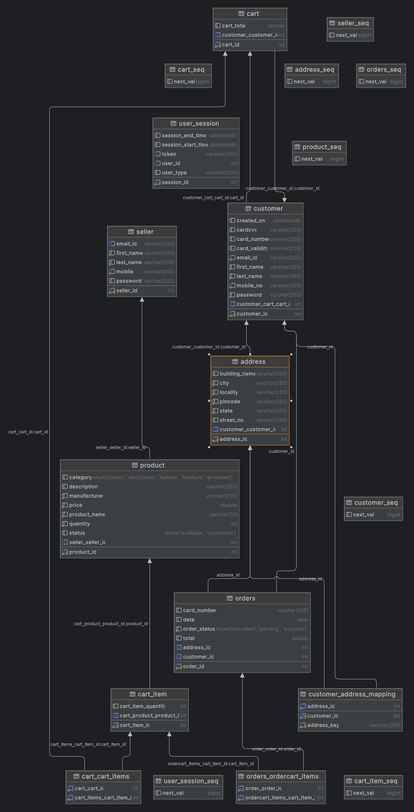
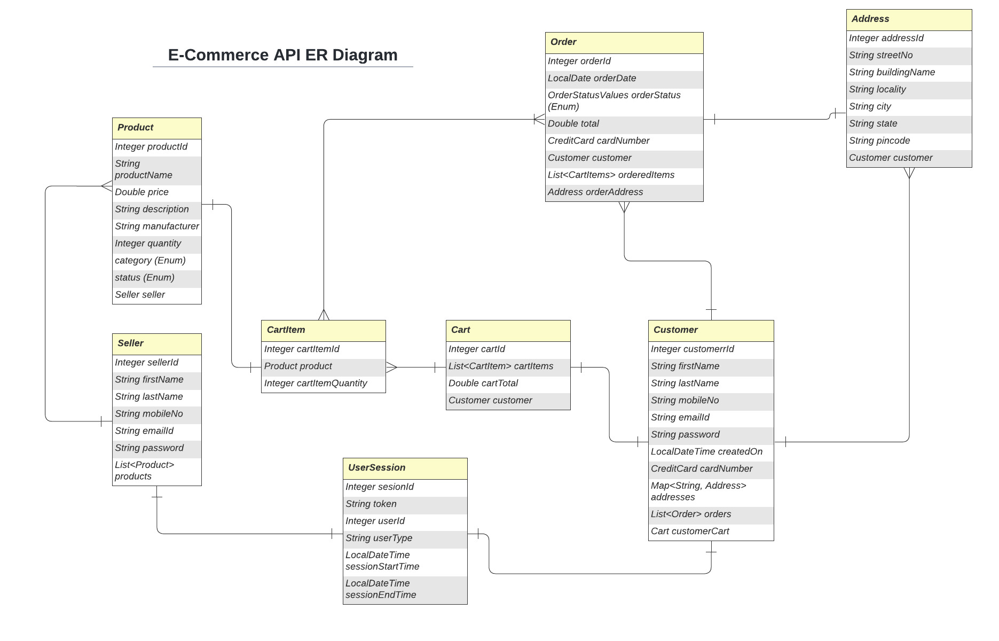
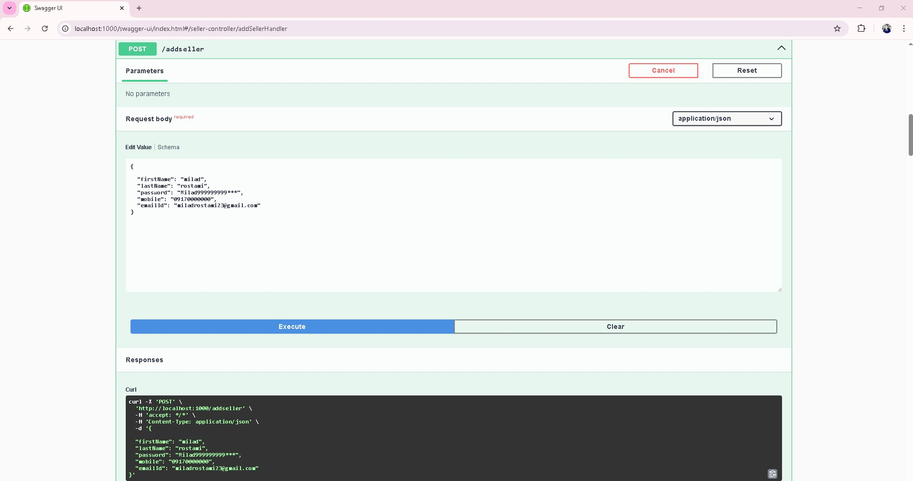
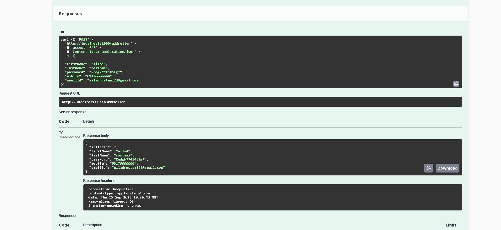
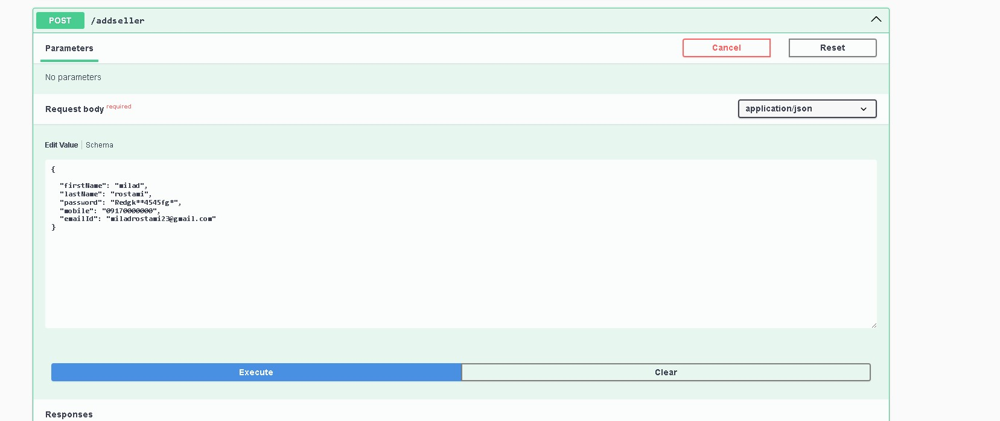
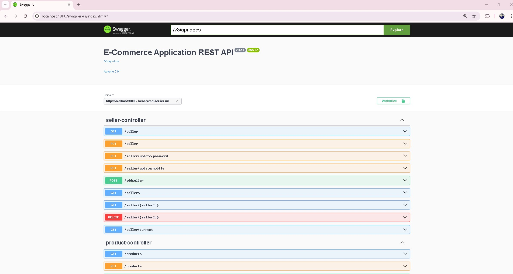
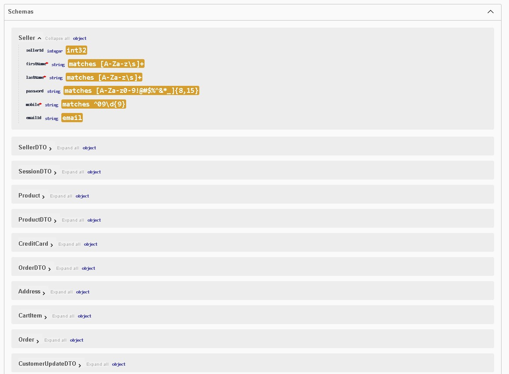
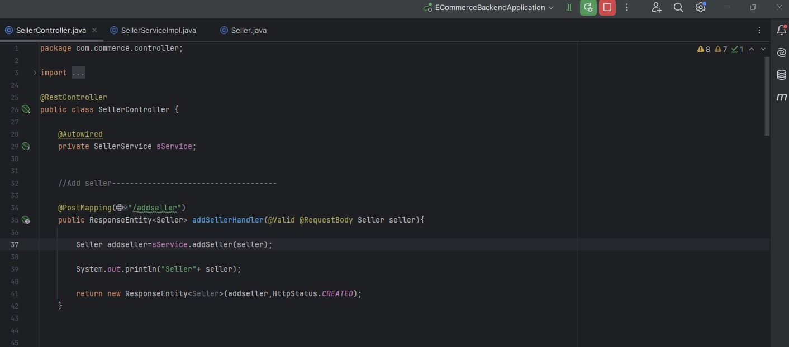
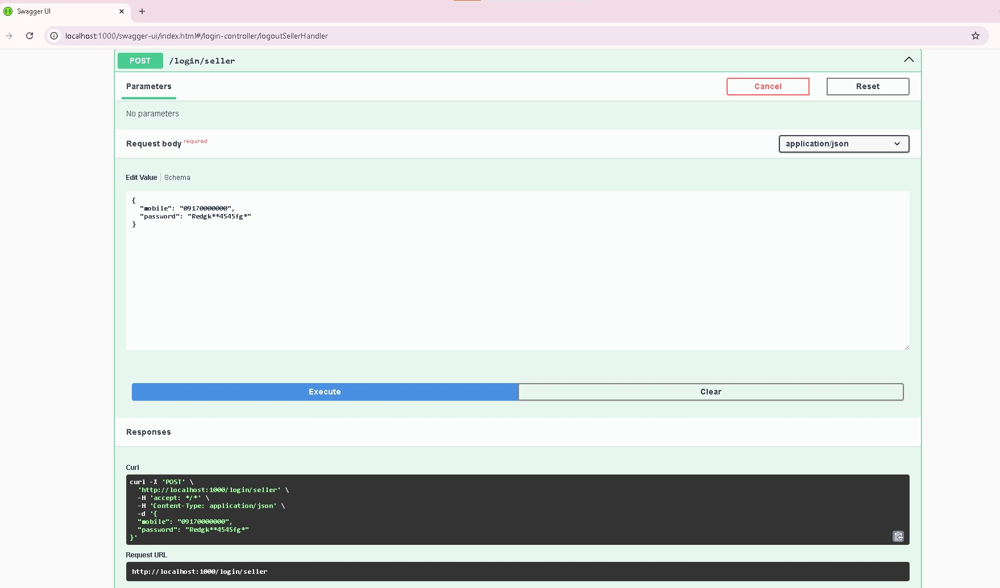
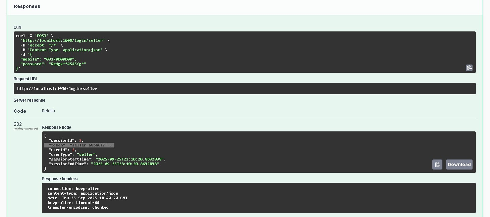
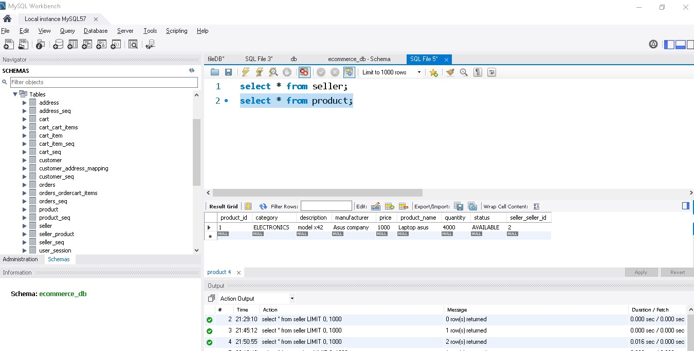
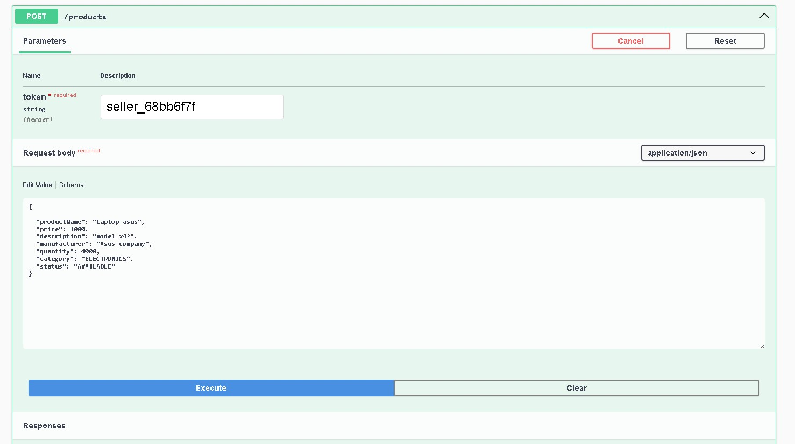
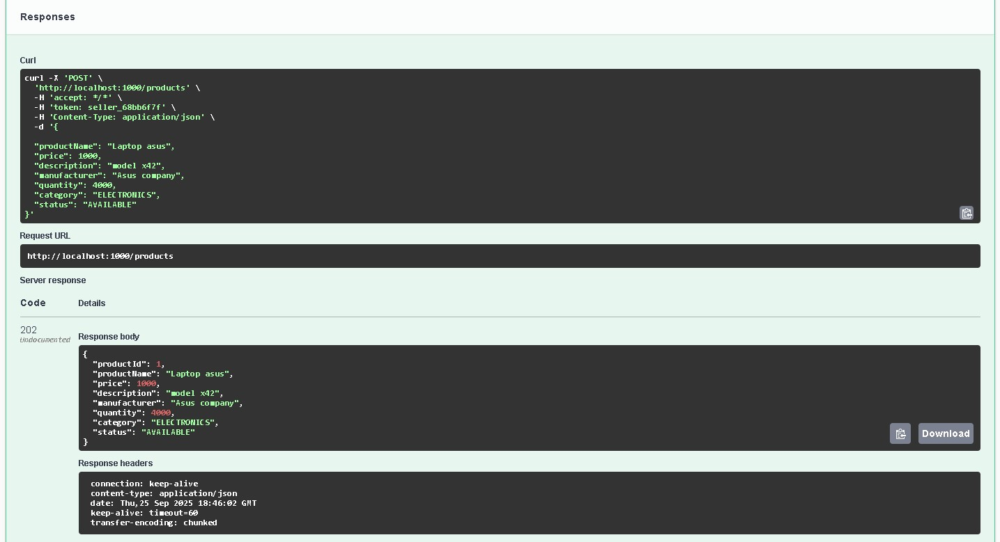

## API Root Endpoint

Base URL: https://localhost:1000/
Swagger Documentation: http://localhost:1000/swagger

### API Module Endpoints
### Login & Logout Module

### Login & Logout Module

* `POST /register/customer` : Register a new customer
* `POST /login/customer` : Logging in customer with valid mobile number & password
* `POST /logout/customer` : Logging out customer based on session token
* `POST /register/seller` : Register a new seller
* `POST /login/seller` : Logging in Seller
* `POST /logout/seller` : Logging out Seller based on session token

### Customer Module

* `GET /customer/current` : Getting currently logged in customer
* `GET /customer/orders` : Getting order history of logged in customer
* `GET /customers` : Getting All customers
* `PUT /customer` : Updates logged in customer
* `PUT /customer/update/password` : Updates customer password
* `PUT /customer/update/card` : Updates credit card details
* `PUT /customer/update/address?type=home` : Updates customer's home address
* `PUT /customer/update/credentials` : Updates email address and mobile number
* `DELETE /customer` : Deletes logged in user with valid session token
* `DELETE /customer/delete/address?type=home` : Deletes customer's home address

### Seller Module

* `GET /seller/{sellerid}` : Gets seller with passed seller Id
* `GET /seller/current` : Gets seller details for currently logged in seller
* `GET /sellers` : Gets all sellers
* `POST /addseller` : Adding new seller
* `PUT /seller` : Updates seller details
* `PUT /seller/update/password` : Updates seller password
* `PUT /seller/update/mobile` : Updates seller mobile number
* `DELETE /seller/{sellerid}` : Deletes seller with passed id

### Product Module

* `GET /product/{id}` : Gets product with given product id
* `GET /products` : Gets all products
* `GET /products/{category}` : Gets product with given category
* `GET /products/seller/{id}` : Gets product of given seller id
* `POST /products` : Adds a new product to database
* `PUT /products` : Updates the product with given product id
* `PUT /products/{id}` : Updates product quantity
* `DELETE /product/{id}` : Deletes product with given id

### Cart Module

* `GET /cart` : Get all items in Customer Cart
* `POST /cart/add` : Add item to Cart
* `DELETE /cart` : Remove item from Cart
* `DELETE /cart/clear` : Clear entire cart

### Order Module

* `GET /orders/{id}` : Gets order details with given order id
* `GET /orders` : Gets all orders
* `GET /orders/by/date` : Gets orders placed on given date (DD-MM-YYYY)
* `POST /order/place` : Places a new order based on cart items
* `PUT /orders/{id}` : Updates a pending order
* `DELETE /orders/{id}` : Cancels an order

## 📞 Contact / Hire Me

I am available for freelance projects and professional collaborations.  
You can reach me through any of the following channels:

- **Mobile / WhatsApp:** +98 917 502 6769
- **Email:** miladrostami24@gmail.com
- **LinkedIn:** [https://www.linkedin.com/in/milad-rostami-07798484/](https://www.linkedin.com/in/milad-rostami-07798484/)
- **Telegram:** [https://t.me/armin7192](https://t.me/armin7192)

